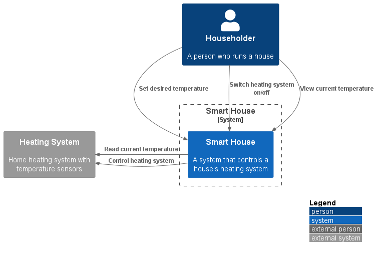
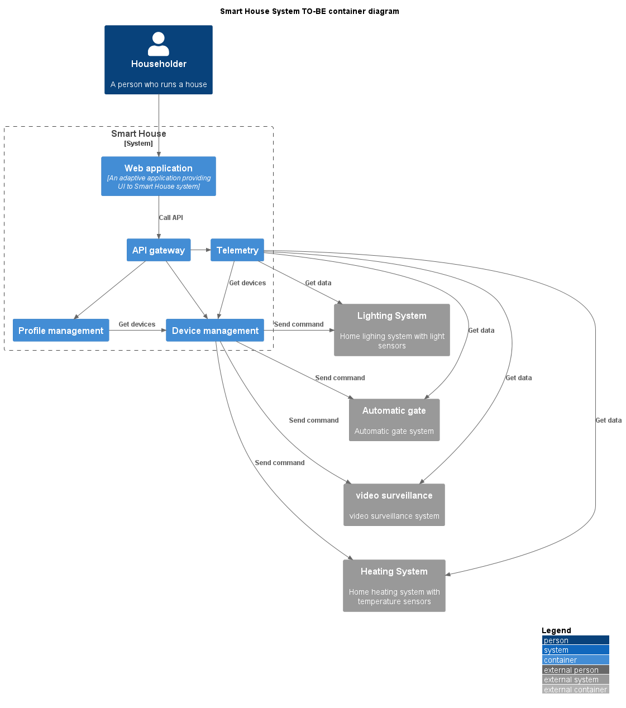

# Sprint 3
## 1.1 Анализ и планирование
**Функциональность текущего монолита:**

Управление отоплением:

* Пользователи могут удалённо включать/выключать отопление в своих домах.
* Пользователи могут устанавливать желаемую температуру.
* Система автоматически поддерживает заданную температуру, регулируя подачу тепла.

Мониторинг температуры:

* Система получает данные о температуре с датчиков, установленных в домах.
* Пользователи могут просматривать текущую температуру в своих домах через веб-интерфейс.

**Архитектура монолитного приложения:**
 
* Язык программирования: Java
* База данных: PostgreSQL
* Архитектура: Монолитная, все компоненты системы (обработка * запросов, бизнес-логика, работа с данными) находятся в рамках одного приложения.
* Взаимодействие: Синхронное, запросы обрабатываются последовательно.
* Масштабируемость: Ограничена, так как монолит сложно масштабировать по частям.
* Развертывание: Требует остановки всего приложения

**Домены и границы контекстов**

Для определения доменов и границ контекстов использовалась методика Domain Storytelling https://domainstorytelling.org.

В результате анализа было выделено 3 основных домена:

* Profile management
* Device management
* Telemetry


**Контекст существующей системы (монолита)**


## 1.2: Архитектура микросервисов

**Components diagram**


**Containers diagram**


**Code diagram**


## 1.3: ER-диаграмма


## 1.4: Создание и документирование API
OpenAPI спецификация микросервисов выделенных согласно результатов DDD приведена в файле **api.yml**

## 2.1 Новые микросервисы и интеграция с монолитом

### 2.1.1 Сборка контейнеров
```bash
docker build -t ghcr.io/sissayenko/device-management-ms:latest .\device-management-ms\

docker build -t ghcr.io/sissayenko/profile-management-ms:latest .\profile-management-ms\

docker build -t ghcr.io/sissayenko/telemetry-ms:latest .\telemetry-ms\

docker build -t ghcr.io/sissayenko/telemetry-harvester-ms:latest .\telemetry-harvester-ms\

docker build -t ghcr.io/sissayenko/smart-home-monolith:latest .\smart-home-monolith\

```
### 2.1.2 Публикация контейнеров
```bash
docker login ghcr.io -u <github_username> --password <github_token>
```

```bash
docker push ghcr.io/sissayenko/device-management-ms:latest

docker push ghcr.io/sissayenko/profile-management-ms:latest

docker push ghcr.io/sissayenko/telemetry-ms:latest

docker push ghcr.io/sissayenko/telemetry-harvester-ms:latest

docker push ghcr.io/sissayenko/smart-home-monolith:latest
```
После публикации сделать в ghcr.io все packages как public

### 2.1.3 Публикация Helm charts в minikube
Развёртывание PostgreSQL
```bash
helm install postgresql oci://registry-1.docker.io/bitnamicharts/postgresql --set auth.database=sprint3 --set auth.postgresPassword=admin 
```

Подключиться к PostgreSQL и выполнить скрипт **./create-db/create_db.sql** по развёртыванию БД
```bash 
kubectl port-forward --namespace default svc/postgresql 5432:5432
```

Развёртывание монолита и микросервисов
```bash
helm install smart-home-monolith .\charts\smart-home-monolith\

helm install device-management-ms .\charts\device-management-ms\

helm install profile-management-ms .\charts\profile-management-ms\

helm install telemetry-harvester-ms .\charts\telemetry-harvester-ms\

helm install telemetry-ms .\charts\telemetry-ms\
```

### 2.1.4 Порядок вызова методов для проверки
profile-management-ms POST /householders -> householderId
profile-management-ms POST /householders/{householderId}/houses -> houseId
device-management-ms POST /devices {houseId: houseId, deviceType: HEATER} -> deviceId
device-management-ms POST /devices {houseId: houseId, deviceType: GATE} -> deviceId

device-management-ms GET /devices/{deviceId}

# Базовая настройка

## Запуск minikube

[Инструкция по установке](https://minikube.sigs.k8s.io/docs/start/)

```bash
minikube start
```

## Добавление токена авторизации GitHub

[Получение токена](https://github.com/settings/tokens/new)

```bash
kubectl create secret docker-registry ghcr --docker-server=https://ghcr.io --docker-username=<github_username> --docker-password=<github_token> -n default
```


## Установка API GW kusk

[Install Kusk CLI](https://docs.kusk.io/getting-started/install-kusk-cli)

```bash
kusk cluster install
```


## Настройка terraform

[Установите Terraform](https://yandex.cloud/ru/docs/tutorials/infrastructure-management/terraform-quickstart#install-terraform)


Создайте файл ~/.terraformrc

```hcl
provider_installation {
  network_mirror {
    url = "https://terraform-mirror.yandexcloud.net/"
    include = ["registry.terraform.io/*/*"]
  }
  direct {
    exclude = ["registry.terraform.io/*/*"]
  }
}
```

## Применяем terraform конфигурацию 

```bash
cd terraform
terraform apply
```

## Настройка API GW

```bash
kusk deploy -i api.yaml
```

## Проверяем работоспособность

```bash
kubectl port-forward svc/kusk-gateway-envoy-fleet -n kusk-system 8080:80
curl localhost:8080/hello
```


## Delete minikube

```bash
minikube delete
```
